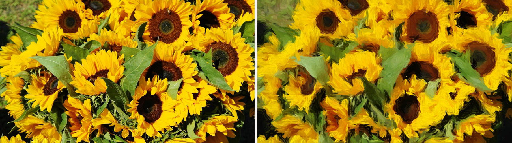
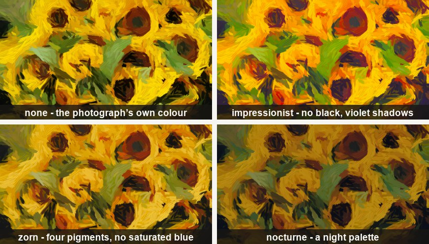
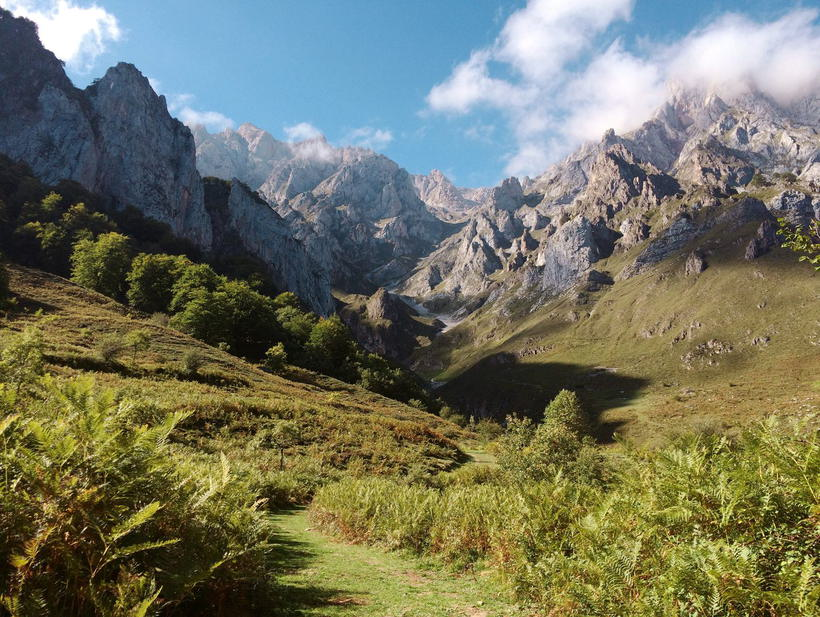
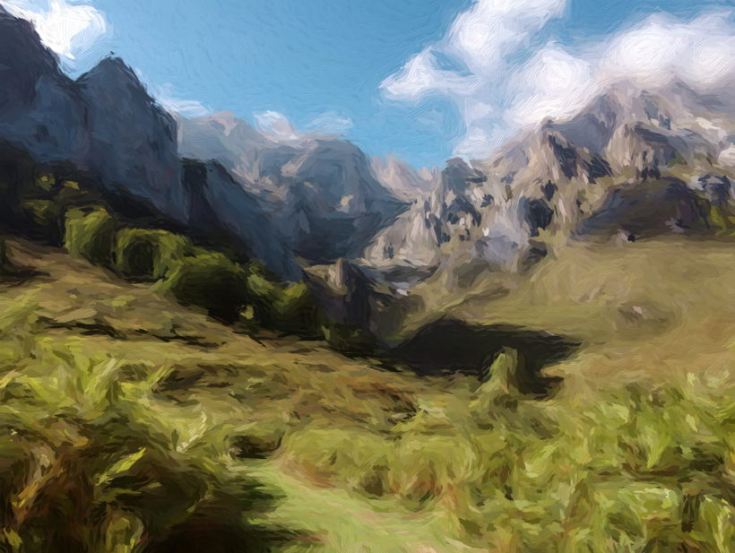
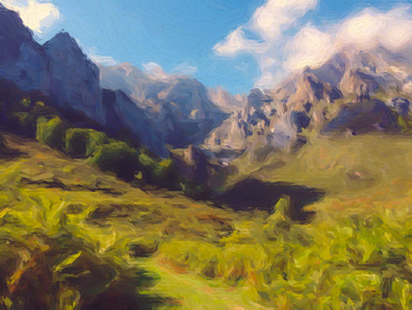
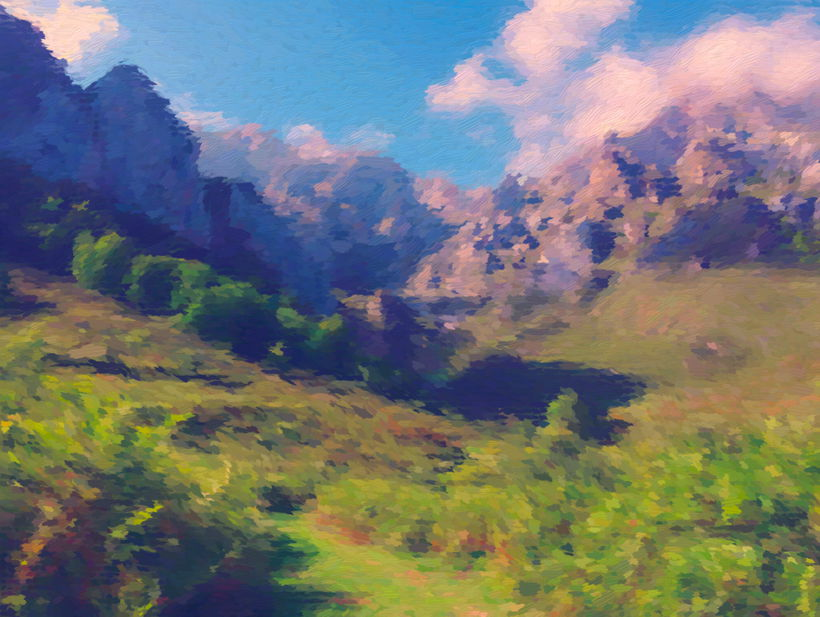
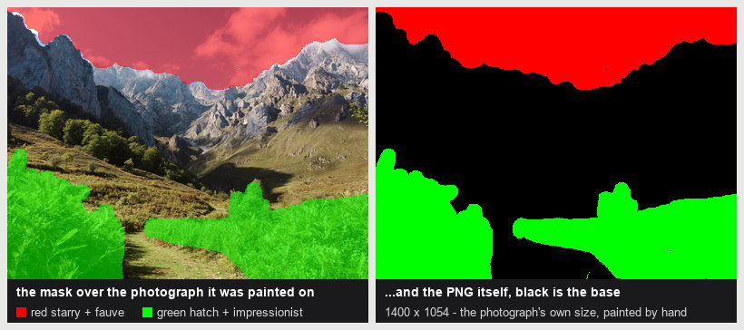
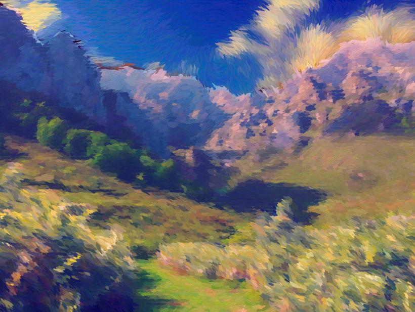

# Oil Paint Tuner

Turn a photograph into an oil painting — in your browser, with the sliders in your hands.



### ▶ [Open the tuner](https://miya9756.github.io/Oil-Paint-Tuner/)

Drop a picture in, move a slider, watch the painting change. Nothing is uploaded and
nothing is downloaded: the whole painter runs inside the page, on your machine, offline.
There is no account, no server, no upload limit, and no queue.

---

## Try it

It is live at **<https://miya9756.github.io/Oil-Paint-Tuner/>** — one page, nothing to
install. It opens on a sample photograph already painted, so there is something to play with
immediately; drop your own in at any time, or use the **Clear** button to start over. That
opening picture is [`examples/sample.oilpaint.json`](examples/sample.oilpaint.json), the same
file the command line takes, so anything you meet there you can reproduce here.

To run the same page from this repository instead:

```bash
python web/tune/serve_tune.py        # then open http://localhost:8137
```

That is the whole setup. You need Python with **numpy** and **Pillow** installed, and
nothing else — no build step, no `npm install`, no GPU. The deployed page is built from this
tree by [`web/tune/build_static.py`](web/tune/build_static.py) and published by
[`.github/workflows/ci.yml`](.github/workflows/ci.yml) on every push to `main`.

## What it actually does

It is not a filter, and there is no neural network in it.

The tool *looks* at your photograph and decides where a painter would spend their effort —
lots of small strokes where the detail is, a few big ones across a plain sky. Then it works
out which way the form runs at each of those places, and lays down one brush stroke there,
turned to follow it. Strokes go down coarse first and fine last, the way a painting is
actually built up, over an underpainting so no gap shows through.

Every mark is a real brush stroke, not a texture: it has a direction, a length, a colour
mixed from a palette, bristle streaks, a tapered end, and a thickness that catches the
light. You can move all of that.

Because nothing is optimised or learned, a change is instant to explain and instant to
undo. A slider does one thing, and the same settings always give you the same painting.

## The palette

The colour a painter would have *mixed*, rather than the one the camera recorded. Each
preset stands for a real set of tubes, so it changes what the painting is able to say:



There are six palettes, and every one of them has trims under it — warmth, chroma, how far
the colour departs from the photograph — so a preset is a starting point rather than a
destination.

You can also point the painting at a **famous picture** instead: *Starry Night*, *The Great
Wave*, *Water Lilies*, *Sunflowers*, *The Scream*, or a Vermeer. That moves your
photograph's colours onto the masterpiece's, and it composes with the palette — the
reference sets the mood, the palette sets the tubes.

## The panel

Seven groups of controls live in the **Color**, **Strokes**, **Flow**, and **Light** tabs.
The main choices come first; each tab folds its detailed trims under **Fine adjustments**.

| group                  | what it changes                                                                                                                                                        |
| ---------------------- | ---------------------------------------------------------------------------------------------------------------------------------------------------------------------- |
| **Allocation**   | How many strokes, how big they can get, and where they go. This is the single biggest lever on how abstract the painting looks.                                        |
| **Palette**      | The colour: which pigments, how far from the photograph, warmth, and the optional famous-painting reference.                                                           |
| **Flow**         | Which way the marks run. Leave it off and they follow the photograph's own structure; turn it on and they follow a field you choose — swirling, rippling, or hatched. |
| **Geometry**     | The shape of a stroke: how long and thin it gets, how far it may wander from where it was placed, and how strongly it commits to a direction.                          |
| **Irregularity** | The hand. Size variation, wobble, colour drift, bristle streaks, tapered ends — the things that stop it looking machine-made.                                         |
| **Paint**        | The underpainting, the edge hardness of a mark, and how thickly the paint covers.                                                                                      |
| **Impasto**      | Thickness and light. The paint is built as a real height field and then lit, so you can rake a light across the picture and watch the ridges catch it.                 |

Turn on **Control help** under **Workspace options** and every control explains itself in place.

**Stats** shows the numbers behind the current render — stroke count, coverage — for when
you want to know *why* a change did what it did. It is off by default, because the page is
for looking at a picture. Warnings always show, whether stats are on or not.

## Three ways to point at part of the picture

Sliders change the whole painting. These three tools let you aim at one passage of it.

**Foveal map** — paint roughly over the part of the picture you care about, and the stroke
budget moves there. A photograph's own detail is not the same as what your eye cares about:
a gravel path scores higher than a face, every time. This is how you tell it otherwise.
The budget is *redistributed*, never increased, so the rest of the picture goes broader as
the marked part goes finer.

**Layers** — click to fill regions, then give each one its own palette and its own flow.
Van Gogh's sky over Monet's water, in one picture. Regions you do not paint keep whatever
the base is set to.

All three are ordinary PNGs both ways: **Save mask** / **Save map** write one out at your
photograph's own size, **Load mask** / **Load map** take one back, and a mask you loaded is
saved back unchanged until you paint on it. So the fiddly boundary can be done in a real
image editor and the rest here.

**Swirl centres** — when a swirling flow field is on, click to place the centres of the
swirls by hand instead of taking the default arrangement. Positions are stored as fractions
of the image, so they land in the same place whatever size you render at.

## One picture, built up

Here is what all of that does to a real photograph, one setting at a time. Every painting
below is the one above it with **a single setting added** — same photograph, same stroke
budget, same seed — so what you are looking at in each is what that one setting did, and
nothing else.

This is also the picture the tuner opens on, so you can start from the last step and work
backwards. The photograph is the sample the page ships with: sky, bare limestone, and a
foreground of sunlit bracken — three passages a painter would treat differently.



### 1. The strokes

Every artistic control off. Eleven thousand strokes are placed where the picture asks for
them — coarse ones first across the plain sky, fine ones last along the ridges — each
turned to follow the form underneath it, over a blurred first pass so no gap shows through.
The colour of every mark is taken straight from the photograph.

This is the painter with nothing on top of it, and it is already not a filter: the plain sky
gets the longest marks and the busy bracken the shortest, because that is where a painter
would slow down.



### 2. A palette

`--palette impressionist --palette-strength 0.7`

The colour a painter would have *mixed*, rather than the one the camera recorded. Black
leaves the picture — there is no black tube on this palette, and the darkest thing it can
mix is ultramarine over alizarin — so the shadows in the rock go violet instead of grey.

Worth noticing what did *not* happen. All 11,720 strokes are in exactly the same places, at
the same angles and the same sizes as the step above. Only the pigment on them changed.



### 3. A famous painting's colours

`--reference water-lilies --reference-strength 0.55`

Instead of describing the colour you want, point at a picture that already has it. This
moves the photograph's colour distribution onto Monet's — not an average tint, but the whole
shape of it, so the darks go blue while the lights stay warm.

It composes with the palette rather than replacing it: the reference decides the
*statistics*, the palette decides which tubes a stroke may actually land on. And like the
palette, it moves no stroke — the same 11,720 marks, still in the same places.


### 4. A flow field, over the whole picture

`--flow waterlily --flow-strength 0.7`

Now the marks stop following the photograph's own structure and follow a field you choose —
here a horizontal weave of short dabs, Monet's water.

Over the bracken it is exactly right. Over the sky it is merely *applied*, and the clouds go
soft and directionless, because a field that acts on the whole picture acts on the parts that
did not ask for one. That is what the next step is for.



### 5. Layers: the same idea, aimed

Hand it a mask and each passage is painted on its own terms. The sky gets a swirling field
(`1:flow=starry`), the bracken a diagonal hatch (`2:flow=hatch`), and the limestone is in no
layer at all, so it keeps the weave the base is set to.



The mask is an ordinary PNG, read through a legend: black is the base, and each other colour
is one layer. This one was painted by hand at the photograph's own 1400 × 1054, so it lines
up pixel for pixel — you fill a layer by clicking on the page, or paint the PNG in any image
editor and load it back. Nothing here detects a sky for you.

The limestone is the thing to look at: every stroke outside a layer comes out untouched.
That is an invariant the test suite checks exactly, not a happy accident of this picture.


### 6. A palette and a reference per layer

A layer carries colour as well as direction, so the sky can be painted out of a different box
of tubes than the ground in front of it — and can borrow a different painting's colour.

The sky goes to `palette=fauve` under *Starry Night*; the bracken to `palette=impressionist`
under *The Great Wave*, its hue turned towards gold and its broken colour raised. The
limestone is in neither layer, so it keeps *Water Lilies* from step 3. Three references, one
picture.



### 7. Swirl centres, placed by hand

A swirling field arranges its centres on a spiral unless you tell it otherwise. Three clicks
in the sky and the clouds re-comb around the points you chose instead. Neighbouring swirls
turn opposite ways, and the positions are stored as fractions of the image, so they land in
the same place whatever size you finally render at.


### That last picture is the one the page opens on

It is also a file you can send someone. The whole setup — every slider, both layers, the
swirl centres and the mask — saves as a small folder, which is what the tuner's **Save
project** button writes:

```
my-painting.oilpaint.json     the recipe
my-painting.regions.png       the layer mask
```

The mask is an ordinary PNG on purpose, so you can open it in any image editor, paint it over
the photograph and save it back — for a complicated boundary that is a far better tool than
clicking to fill. Drop the whole set back on the page to carry on, or paint it from the
command line:

```bash
python scripts/paint.py web/tune/sample.jpg painting.png \
    --project examples/sample.oilpaint.json --max-side 1400
```

The photograph is deliberately not inside it — a project is the recipe, not the ingredients,
so running it over a *different* photograph is a perfectly sensible thing to do. The masks
can also be folded into the `.json` itself, which is what the shipped examples do so that
each is one file; see [`examples/`](examples/) for both forms.

## Rendering at full size

The preview renders at about 1100 pixels across, so that dragging a slider feels immediate.
When you have the look you want, turn on **High resolution** below the inspector. That
paints at your photograph's own resolution, which on a phone photo is seconds to a minute
of work. **Save PNG** writes the finished image. If **Auto render** is off, use **Render**
after adjusting settings.

A big render tells you what it is doing rather than showing a spinner — it names the stage
it is in, and once it has been going for more than half a second it streams the painting
onto the canvas as it is made. The ground first, then the strokes going down a few hundred
at a time, then the light. Change your mind mid-render and it stops immediately rather than
making you wait it out.

Your image and your settings are remembered between visits, so closing the tab does not
lose your work.

## The atelier workspace

The tool rail holds **Compare**, **Focus**, **Layers**, and **Light**. A single inspector
groups settings into **Color**, **Strokes**, **Flow**, and **Light**, with fine adjustments
under each tab. Use the arrow keys, Home, or End to navigate the tabs; the divider beside
the inspector can also be resized with the keyboard. **Project** contains setup import,
export, and reset actions. Help and render statistics are under **Workspace options**.

**View painting** opens a framed gallery view of the existing render. **Back to editing**
or Escape restores your inspector, tool, and layer selection. Gallery mode does not change
the painting settings or export resolution. On smaller screens the tools form a horizontal
row and the painting stays above the scrollable controls.

## Studio light

Choose **Light** on the tool rail, or **Enter the studio** in the inspector, to hang your
painting in a 3D clockwork salon, with curved walnut furniture, a porcelain tea service,
and a suspended chandelier. Brass gears turn slowly behind bronze-framed glass. Soft shadows,
reflected light, and a softly reflective stone floor give the room its depth. Drag to look around.
Dark timber ribs and brass trim finish the edges, and the view stays within the gallery.
Use the +/− buttons to move closer or step
back. **Reset view** brings you home. The expand icon beside **Close-up** opens the studio
fullscreen; Escape returns to the editor layout. Choose oak, walnut, or black framing, and switch
between **Amber daylight** and **After hours** to see it under the room's spotlights.
**Clockwork motion** pauses or resumes the linked gears in the display cases.

Use the direction and height sliders to light the brushwork, or try **Daylight**, **Raking
light**, and **Overhead**. **Close-up** fills the view with the painting and lets you drag
the light directly. The arrow keys move the light in either view. In the room, Shift +
arrow keys change your viewpoint, +/− change distance, and Home resets the camera.

**Apply lighting** keeps the chosen light in your settings and renders it into the PNG.
**Cancel** or Escape returns to the painting without changing it. Frame, room atmosphere,
and viewpoint are presentation choices and do not appear in the PNG. The brushwork uses
the same lighting as the painter, so the close-up lets you judge the light you will save.

The Three.js preview and its bundled furniture load on demand from local files.
The supplied furniture models have repaired faces and normals; their preparation notes
are in [the asset folder](web/tune/studio-assets/README.md).
It needs WebGL 2; if that is unavailable, the ordinary painter and its lighting sliders
remain usable. No image is sent elsewhere. The gears respect reduced motion and pause
when the tab is hidden or you switch to Close-up. With motion off, the room stops drawing
once the camera settles. Look changes use a short brush reveal.

The optional GPU and interaction checks use Node 22+ and a local Chrome debugging session:

```bash
node tests/test_studio_browser.mjs http://localhost:9231 http://localhost:8141
```

The first address is Chrome's debugging endpoint; the second is the running tuner.
The checks create and dispose an isolated browser context, leaving existing tabs alone.

## From the command line

The same painter, without the browser:

```bash
# one image in, one painting out
python scripts/paint.py photo.jpg painting.png --max-side 1400
```

Every control on the panel is also a flag:

```bash
python scripts/paint.py photo.jpg painting.png \
    --palette impressionist --palette-strength 0.8 --broken-color 0.3

python scripts/paint.py photo.jpg painting.png \
    --flow starry --flow-strength 0.85 --palette nocturne

python scripts/paint.py photo.jpg painting.png \
    --reference starry-night --reference-strength 0.75
```

The masks the page's tools produce work here too — `--foveal mask.png` and
`--regions mask.png` — so you can aim a look on the page and then batch it over a folder.
If you paint one by hand instead, black is the meaningful colour on both: on a foveal map it
means *spend the strokes here*, and on a region mask it is the base that everything left
unpainted falls back to.
The page's **Copy setup** button puts the current settings on your clipboard.

You can also measure a colour reference off a painting you have the rights to:

```bash
python scripts/extract_reference.py painting.jpg --name my-reference
```

## Running and developing

```bash
python web/tune/serve_tune.py           # the tuner, live from source    -> :8137
python web/tune/build_static.py --serve # the deployable page, previewed -> :8138
```

`serve_tune.py` is the one to use while editing. The only thing it adds over a plain static
file server is `schema.json`, which is generated from
[`oilpaint/schema.py`](oilpaint/schema.py) so the control panel can never drift from the
parameters it is supposed to expose.

`build_static.py` assembles [`public/`](public/) — plain HTML, JS and CSS, nothing fetched
at runtime — which is what gets published.

### Layout

```
oilpaint/          the painter, in Python
  image.py         load/save, colour spaces, the fast area lookups
  detail.py        five ways of measuring "how much is going on here"
  quadtree.py      dividing the picture up, and hitting a stroke budget
  tensor.py        which way the form runs at each point
  strokes.py       turning cells into brush strokes
  render.py        laying the paint down, and lighting it
  palette.py       the pigment sets and the colour grade
  reference.py     matching a famous painting's colours
  flow.py          the artistic direction fields
  regions.py       aiming a look at one passage
  pipeline.py      the orchestration, and every parameter's default
  schema.py        the control panel, generated from the above
web/tune/          the browser side
  oilpaint/*.js    the same painter, ported to JavaScript file for file
  index.html       the tuner page
  engine.worker.js the worker that does the painting off the UI thread
scripts/           the command line, and two smaller tools
tests/             the suites that hold the two implementations together
```

### The one thing to know before changing anything

The painter exists **twice** — once in Python, once in JavaScript — because the browser
version has to run with no server behind it. Python is the source of truth. Four test
suites hold the two together, and they take seconds:

```bash
python tests/test_core.py             # the painter's own invariants
python tests/test_rng_parity.py       # the random numbers, bit for bit
python tests/test_raster_parity.py    # the brush, stroke for stroke
python tests/test_pipeline_parity.py  # every stage, and the real worker
python web/tune/verify_page.py        # the page, driven end to end
```

The parity suites need `node`. The result they protect is that the browser and the command
line produce **the same painting, byte for byte at 8 bits** — so a look you find on the
page is a look you can render at full size from a script.

There is no build step for the page, which means `verify_page.py` is the only thing that
catches a broken edit to it. Run it after touching `web/tune/index.html`.

## Built on

The technique is a descendant of a long line of work in non-photorealistic rendering. Four
papers are load-bearing:

- **Haeberli, P.** *Paint By Numbers: Abstract Image Representations.* ACM SIGGRAPH Computer
  Graphics **24**(4), 1990, pp. 207–214. — the founding idea, a painting as an ordered
  collection of strokes sampling the source.
- **Litwinowicz, P.** *Processing Images and Video for an Impressionist Effect.* SIGGRAPH 97,
  pp. 407–414. — strokes oriented along the isophotes, and randomly perturbed to keep the
  hand in them.
- **Hertzmann, A.** *Painterly Rendering with Curved Brush Strokes of Multiple Sizes.*
  SIGGRAPH 98, pp. 453–460, and *Fast Paint Texture*, NPAR 2002. — the opaque coarse
  underpainting, and the height field that makes a stroke edge a ridge.
- **Samet, H.** *The Quadtree and Related Hierarchical Data Structures.* ACM Computing
  Surveys **16**(2), 1984, pp. 187–260. — the subdivision and its variance criterion.

Three more it draws on, and one it deliberately does not follow:

| work                                                                  | what this takes from it                                                                                         |
| --------------------------------------------------------------------- | --------------------------------------------------------------------------------------------------------------- |
| Hays & Essa,*Image and Video Based Painterly Animation* (NPAR 2004) | smoothing the direction field instead of trusting it pixel by pixel                                             |
| Kang, Lee & Chui,*Coherent Line Drawing* (NPAR 2007)                | a stronger way of reading direction out of an image                                                             |
| Zhang et al.,*GaussianImage* (ECCV 2024)                            | the optimised counterpart — deliberately not followed, because a perfectly fitted result is a photograph again |

Every citation is reproduced in full in [`oilpaint/__init__.py`](oilpaint/__init__.py),
beside the code that implements it.

---

© 2026 Mingyang Song. All rights reserved.
